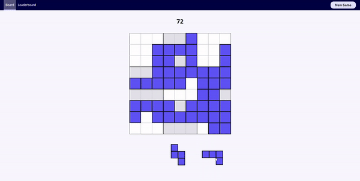

Check out the website here: https://mystifying-wiles-ca5629.netlify.app/

I used to play BlockuDoku on the iPhone a lot. And by a lot, I mean was very much addicted to the game. This was to the point that I would be willing to turn my phone on airplane mode in order to avoid all of the ads that this app made me watch!

I got so sick and tired of the ads I decided to make the game as a web application. I added a leaderboard so my friends and I could compete against each other. 

Below or some GIF's of the gameplay. 

#### Drag the block onto the board. Shadow on the board shows where block will get dropped. Get points per block added. 

#### Complete a row, column, or square to remove those blocks and get extra points. 

#### Remove more than one or remove blocks in consecutive turns to get a bonus!

#### Blocks gray out on bottom when they cannot fit in puzzle. 

#### Try it out on mobile, too!

#### Board and scores save to local storage. 

#### Save name to leaderboard after losing. 
###### No using bad words, though! Shoutout to Neutrino API - allows me to add custom bad words so I can add "b3ar5" as a bad word. Go Packers!

#### Leaderboard shows highest score and most recent score. 

